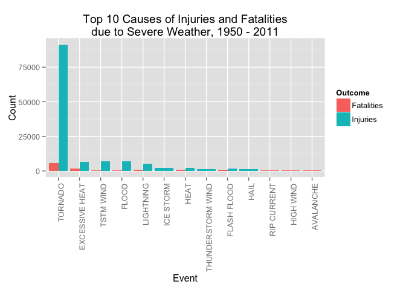

# Examining the Impact of Severe Weather Events from 1950 - 2011
Jack Gidding  
September 24, 2015  

A key concern of governments is the well being of its citizens. Storms and other severe weather events can cause both public health and economic problems for communities and municipalities. Weather events can result in fatalities, injuries, and property damage. Preventing such outcomes should be addressed by government in terms of public policy. In order to set the right policy in this area, we must answer two questions. First, which types of events are most harmful with repect to the population? Second, which types of events have the greatest economic impact? To answer these questions for the United States, we examine data from the U.S. National Oceanic and Atmospheric Administration's (NOAA) storm database.

## Data Processing
Load the libraries that will be used in the analysis. 


```r
library(R.utils)
library(lubridate)
library(plyr)
library(ggplot2)
```

The NOAA storm data is loaded into the environment for processing. The bzipped datafile is stored in the GitHub repository. If the csv data file does not exist, then data data is unzipped and verified. 


```r
filename.data <- "repdata-data-StormData.csv"
if (!file.exists(filename.data)) {
    bunzip2(paste(filename.data,".bz2",sep=""))
}

# Check postcondition
if (!file.exists(filename.data)) {
    errMsg <- paste("Error: Data file (",filename.data,") does not exist.",sep="")
    stop(errMsg)
}

# Read in the data
data.noaa <- read.csv(filename.data)

# Check the characteristics
nrow(data.noaa)
```

```
## [1] 902297
```

```r
length(data.noaa)
```

```
## [1] 37
```

There are 902,297 events in the database and 37 fields/characteristics of each event. The fields that will be used during this report are:

- EVTYPE: The reported event type.
- BGN_DATE: The start date of the event. Used as the event date.
- FATALITIES: Quantity of fatalities due to the event.
- INJURIES: Quantity of injured persons due to the event.
- PROPDMG: Damage to property in US Dollars.
- PROPDMGEXP: the magnitude of the PROPDMG field.
- CROPDMG: Damage to crop fields in US dollars.
- CROPDMGEXP: the magnitude of the CROPDMG field.

The magnitue fields are reported as K", "M" or "B" for thousands, millions or billions times the value reported in PROPDMG or CROPDMG. 

The start and end dates for each event is turned into a datetime representation useful for processing. The hours and minutes of each event is stored in a separate column. Since that information is not material to this study, it is not processed and added to the datetime object.


```r
# Turn the start and end dates into POSIXct objects for processing
data.noaa[ ,2] <- parse_date_time(data.noaa[ ,2], "m*!/d*!/y! H!:M!:S!")
data.noaa[ ,12] <- parse_date_time(data.noaa[ ,12], "m*!/d*!/y! H!:M!:S!")

# Normalize all EVTYPE strings to uppercase
data.noaa[ ,8] <- toupper(data.noaa[ ,8])
```

## Results

### Impact on Public Health

In order to answer the first question, the number of fatalities and injuries are calculated for each event type from the NOAA storm data. 


```r
# Summarize the data for fatalities and injuries
data.fatalities <- aggregate(data.noaa$FATALITIES, by=list(data.noaa$EVTYPE), sum)
data.injuries <- aggregate(data.noaa$INJURIES, by=list(data.noaa$EVTYPE), sum)

# Rename the columns
colnames(data.fatalities) <- c("Event","Count")
colnames(data.injuries) <- c("Event","Count")

# Sort the data 
data.fatalities.sorted <- arrange(data.fatalities, data.fatalities$Count,
                                  decreasing=TRUE)
data.injuries.sorted <- arrange(data.injuries, data.injuries$Count,
                                  decreasing=TRUE)
colnames(data.fatalities.sorted) <- c("Event","Count")
colnames(data.injuries.sorted) <- c("Event","Count")
```
Once we have the data summarized and sorted, we can derive top 10 lists of weather related causes of fatalities and injuries. 

#### Top 10 Causes of Fatalities


```r
data.fatalities.top10 <- head(data.fatalities.sorted, n=10)
colnames(data.fatalities.top10) <- c("Event","Count")
data.fatalities.top10
```

```
##             Event Count
## 1         TORNADO  5633
## 2  EXCESSIVE HEAT  1903
## 3     FLASH FLOOD   978
## 4            HEAT   937
## 5       LIGHTNING   816
## 6       TSTM WIND   504
## 7           FLOOD   470
## 8     RIP CURRENT   368
## 9       HIGH WIND   248
## 10      AVALANCHE   224
```

#### Top 10 Causes of Injuries


```r
data.injuries.top10 <- head(data.injuries.sorted, n=10)
colnames(data.injuries.top10) <- c("Event","Count")
data.injuries.top10
```

```
##                Event Count
## 1            TORNADO 91346
## 2          TSTM WIND  6957
## 3              FLOOD  6789
## 4     EXCESSIVE HEAT  6525
## 5          LIGHTNING  5230
## 6               HEAT  2100
## 7          ICE STORM  1975
## 8        FLASH FLOOD  1777
## 9  THUNDERSTORM WIND  1488
## 10              HAIL  1361
```
#### Plot comparing Fatalities and Injuries

Next, the top 10 causes of fatalities and injuries are plotted side-by-side on the same chart to show the relative magnitude.  


```r
# Add column to identify fatalities
data.fatalities.top10[ ,3] <- "Fatalities"
colnames(data.fatalities.top10) <- c("Event","Count", "Outcome")

# Add column to identify injuries
data.injuries.top10[ ,3] <- "Injuries"
colnames(data.injuries.top10) <- c("Event","Count", "Outcome")

# Combine fatalities and injuries into same data.frame
data.combined.top10 <- rbind(data.fatalities.top10, data.injuries.top10)

ggplot(data.combined.top10, aes(x=reorder(Event, desc(Count)), y=Count, fill=Outcome)) + 
    geom_bar(stat="identity", position="dodge") +
    labs(x="Event", y="Count") +
    theme(axis.text.x = element_text(angle = 90, hjust = 1)) +
    labs(title="Top 10 Causes of Injuries and Fatalities\ndue to Severe Weather, 1950 - 2011")
```

 

In the plot above, we can see that the top two causes of fatalities are tornado and excessive heat. The top two causes of injuries are tornado and tstm wind. The tornado holds the top spot in both fatlities and injuries. With that event, the number of injuries are 16.2 times the number of fatalities. In fact, tornado account for 46.6% of all fatalities in the top 10 and 72.8% of all injuries in the top 10. It also accounts for 37.2% of all fatalities from weather events with fatalities and 65% of all injuries from weather events with fatalities.

### Impact on Economic Loss

To examine the economic loss, the damage must be calculated using the scale factor present in the data. Three new columns are created with the total property damage, total crop damage and total damage, which is the sum of the property and crop damage. 


```r
multX <- function(dmgexp){
    # Multiplers are capital. Make sure by converting to upper
    dmgexp <- toupper(dmgexp)
    
    if (dmgexp == "K") 1000
    else if (dmgexp == "M") 1000000
    else if (dmgexp == "B") 1000000000
    else 1
}

# Calculate the Property, Crop and Total damage
data.noaa[ ,38] <- (data.noaa[ ,25] * sapply(data.noaa[ ,26], function(dmgexp) {multX(dmgexp)}))
data.noaa[ ,39] <- (data.noaa[ ,27] * sapply(data.noaa[ ,28], function(dmgexp) {multX(dmgexp)}))
data.noaa[ ,40] <- data.noaa[ ,38] + data.noaa[ ,39]
colnames(data.noaa)[38] <- c("TOTALPRDMG")
colnames(data.noaa)[39] <- c("TOTALCRDMG")
colnames(data.noaa)[40] <- c("TOTALDMG")
```

In order to answer the second question, the amount of property, crop and total damage are calculated for each event type from the NOAA storm data. The data is sorted by amount of damage.


```r
# Summarize the data for fatalities and injuries
data.propdmg <- aggregate(data.noaa$TOTALPRDMG, by=list(data.noaa$EVTYPE), sum)
data.cropdmg <- aggregate(data.noaa$TOTALCRDMG, by=list(data.noaa$EVTYPE), sum)
data.totaldmg <- aggregate(data.noaa$TOTALDMG, by=list(data.noaa$EVTYPE), sum)

# Rename the columns
colnames(data.propdmg) <- c("Event","Amount")
colnames(data.cropdmg) <- c("Event","Amount")
colnames(data.totaldmg) <- c("Event","Amount")

# Sort the data 
data.propdmg.sorted <- arrange(data.propdmg, data.propdmg$Amount,
                                  decreasing=TRUE)
data.cropdmg.sorted <- arrange(data.cropdmg, data.cropdmg$Amount,
                                  decreasing=TRUE)
data.totaldmg.sorted <- arrange(data.totaldmg, data.totaldmg$Amount,
                                  decreasing=TRUE)

colnames(data.propdmg.sorted) <- c("Event","Amount")
colnames(data.cropdmg.sorted) <- c("Event","Amount")
colnames(data.totaldmg.sorted) <- c("Event","Amount")
```

Once we have the data summarized and sorted, we can derive top 10 lists of damage. 

#### Top 10 Causes of Property Damage


```r
data.propdmg.top10 <- head(data.propdmg.sorted, n=10)
colnames(data.propdmg.top10) <- c("Event","Amount")
data.propdmg.top10
```

```
##                Event       Amount
## 1              FLOOD 144657709807
## 2  HURRICANE/TYPHOON  69305840000
## 3            TORNADO  56937160779
## 4        STORM SURGE  43323536000
## 5        FLASH FLOOD  16140812067
## 6               HAIL  15732267048
## 7          HURRICANE  11868319010
## 8     TROPICAL STORM   7703890550
## 9       WINTER STORM   6688497251
## 10         HIGH WIND   5270046295
```

#### Top 10 Causes of Crop Damage


```r
data.cropdmg.top10 <- head(data.cropdmg.sorted, n=10)
colnames(data.cropdmg.top10) <- c("Event","Amount")
data.cropdmg.top10
```

```
##                Event      Amount
## 1            DROUGHT 13972566000
## 2              FLOOD  5661968450
## 3        RIVER FLOOD  5029459000
## 4          ICE STORM  5022113500
## 5               HAIL  3025954473
## 6          HURRICANE  2741910000
## 7  HURRICANE/TYPHOON  2607872800
## 8        FLASH FLOOD  1421317100
## 9       EXTREME COLD  1312973000
## 10      FROST/FREEZE  1094186000
```

#### Top 10 Causes of Total Damage


```r
data.totaldmg.top10 <- head(data.totaldmg.sorted, n=10)
colnames(data.totaldmg.top10) <- c("Event","Amount")
data.totaldmg.top10
```

```
##                Event       Amount
## 1              FLOOD 150319678257
## 2  HURRICANE/TYPHOON  71913712800
## 3            TORNADO  57352114049
## 4        STORM SURGE  43323541000
## 5               HAIL  18758221521
## 6        FLASH FLOOD  17562129167
## 7            DROUGHT  15018672000
## 8          HURRICANE  14610229010
## 9        RIVER FLOOD  10148404500
## 10         ICE STORM   8967041360
```

#### Plot comparing Crop and Property Damage

Next, the top 10 amounts of property and crop damage are plotted side-by-side on the same chart to show the relative magnitude. 


```r
# Add column to identify crop damage
data.cropdmg.top10[ ,3] <- "Crop Damage"
colnames(data.cropdmg.top10) <- c("Event","Amount", "Outcome")

# Add column to identify property damage
data.propdmg.top10[ ,3] <- "Property Damage"
colnames(data.propdmg.top10) <- c("Event","Amount", "Outcome")

# Combine fatalities and injuries into same data.frame
data.combineddmg.top10 <- rbind(data.cropdmg.top10, data.propdmg.top10)

ggplot(data.combineddmg.top10, aes(x=reorder(Event, desc(Amount)), y=Amount, fill=Outcome)) + 
    geom_bar(stat="identity", position="dodge") +
    labs(x="Event", y="Damage (USD)") +
    theme(axis.text.x = element_text(angle = 90, hjust = 1)) +
    labs(title="Top 10 Causes of Property and Crop Damage\ndue to Severe Weather, 1950 - 2011")
```

 

In the plot above, we can see that the top two causes of property damage are flood and hurricane/typhoon. The top two causes of crop damage are drought and flood. The flood holds the top spot in total damage. It is the top spot in property damange and second spot in crop damage. With that event, the amount of property damage is 10.4 times the amount of crop damage. In fact, flood account for 38.3% of all property damage in the top 10 and 33.4% of all crop damage in the top 10. It also accounts for 33.9% of all property damage from weather events and 28.5% of all crop damage from weather events.

#### Plot of Total Damage

A plot is also constructed showing the top 10 total damage from severe weather events. 


```r
ggplot(data.totaldmg.top10, aes(x=reorder(Event, desc(Amount)), y=Amount)) + 
    geom_bar(stat="identity", position="dodge",fill="#F35E5A") +
    labs(x="Event", y="Damage (USD)") +
    theme(axis.text.x = element_text(angle = 90, hjust = 1)) +
    labs(title="Top 10 Causes of Total Damage\ndue to Severe Weather, 1950 - 2011")
```

 

We can see that flood takes the top spot. From the section on fatalities and injuries, tornado is in the third spot.  In terms of total property damage, flood accounts for  36.8% of all property damage in the top 10 and 31.6% of all damage. In addition, tornado accounts for  14.1% of all property damage in the top 10 and 12% of all damage. The two events account for 43.6% of all damage from severe weather events.

## Conclusion

From the data in this report, we can see that tornado and flood are two very significant sources of loss in terms of fatalities, property and crop damage. The government could protect its citizens by investing in prediction and detection of tornados. This would allow people in the line of a tornado to get into a safe location. To protect against floods, the government should set policy that set aside land for flood plains and build levies capable of sustaining significant floods around lowlands.

